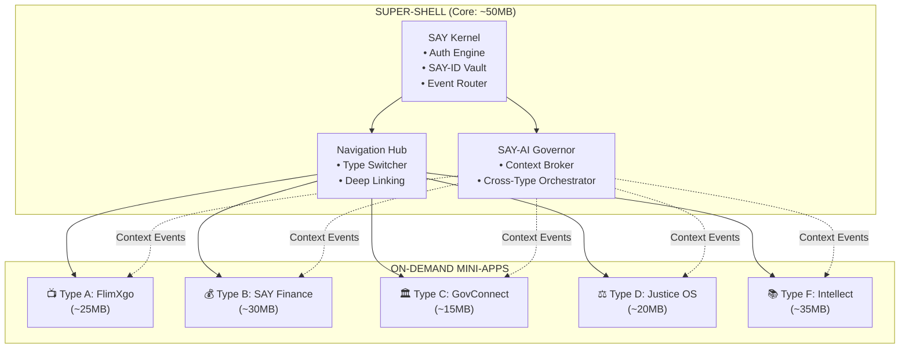
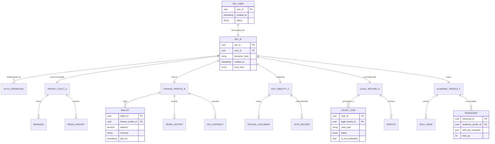
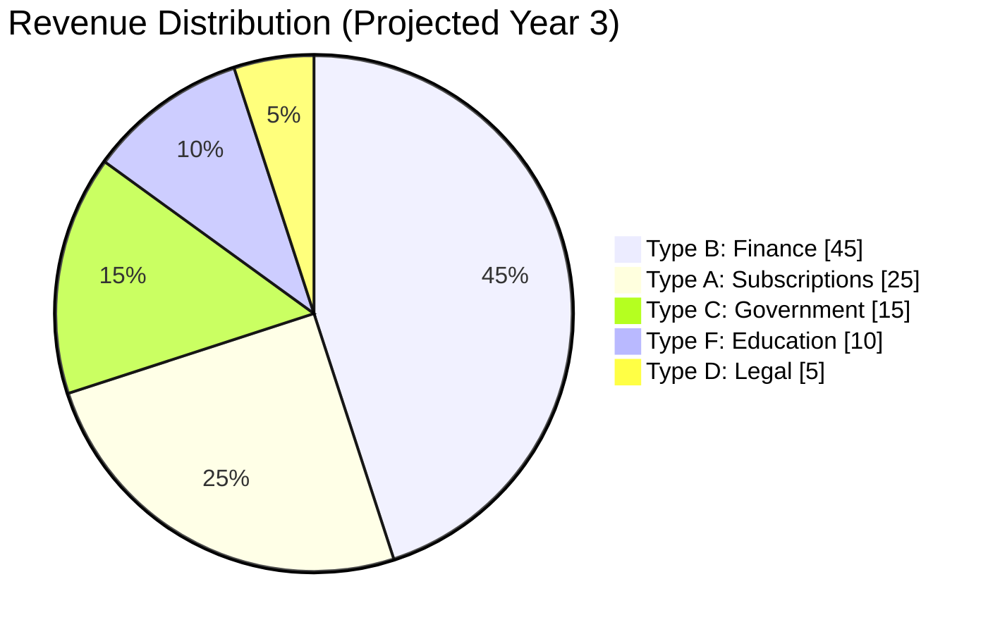

# SUPERWEB Technical Design Document
## Project SAY – Type 6 Civilization OS
**Version:** 6.0 | **Date:** January 17, 2026

---

# SECTION 1: THE "SUPER-SHELL" ARCHITECTURE

## 1.1 The Challenge
Building a single application containing 5 massive ecosystems (Types A, B, C, D, F) without creating a 10GB monolith requires a **Federated Micro-Frontend Architecture**.

## 1.2 Mini-App Container Strategy



### Loading Strategy: "Progressive Module Hydration"

| Phase | Action | Size Impact |
|-------|--------|-------------|
| **Install** | Download Super-Shell Core only | ~50MB |
| **First Launch** | User selects 2 "Home" modules | +40-60MB |
| **On-Demand** | Remaining modules lazy-loaded | +15-35MB each |
| **Background Sync** | Pre-cache predicted modules based on usage AI | Automatic |

### Key Implementation Details

1. **Module Federation (Webpack 5 / Re.Pack)**
   - Each Type (A-F) is a separately compiled bundle
   - Shared dependencies hoisted to Shell (React, auth, UI kit)
   - Runtime composition via dynamic `import()` statements

2. **Hot-Swap Architecture**
   ```
   Shell Kernel → Module Registry → Lazy Loader → Sandboxed Runtime
                        ↓
              Version Manager (A/B Testing, Rollbacks)
   ```

3. **Size Optimization Tactics**
   - Tree-shaking aggressive mode
   - Binary assets served via CDN (not bundled)
   - Differential loading (ES6+ for modern devices, transpiled for legacy)
   - WASM for compute-heavy operations (Type B trading algorithms)

## 1.3 Tech Stack Recommendation

### Frontend Layer

| Component | Technology | Rationale |
|-----------|------------|-----------|
| **Core Framework** | **Flutter 4.x** | Single codebase for iOS/Android/Web/Desktop. Dart's AOT compilation = native performance. Hot reload for rapid iteration. |
| **Alternative** | React Native + Expo | If team has JS expertise. Use Hermes engine. |
| **State Management** | Riverpod (Flutter) / Zustand (RN) | Modular, tree-shakeable state |
| **Local Storage** | Hive (Flutter) / WatermelonDB (RN) | Encrypted, offline-first |
| **Real-time Sync** | Firebase Realtime / Supabase | For Type A messaging |

### Backend Layer

| Service | Technology | Purpose |
|---------|------------|---------|
| **API Gateway** | Kong / Envoy | Rate limiting, auth, routing to Types |
| **Core Services** | **Golang** | High-concurrency: Finance (Type B), Messaging (Type A) |
| **AI Services** | **Python** (FastAPI) | PyTorch inference for SAY-AI Governor |
| **Real-time** | **Elixir/Phoenix** | WebSocket connections, 99.999% uptime |
| **Blockchain** | Solidity / Substrate | Type B escrow, Type C voting |
| **Search** | Elasticsearch / Meilisearch | Cross-module search index |

### Infrastructure

```
┌─────────────────────────────────────────────────────────────────┐
│                     KUBERNETES CLUSTER                          │
├─────────────┬─────────────┬─────────────┬─────────────┬────────┤
│   Type A    │   Type B    │   Type C    │   Type D    │ Type F │
│   Pods      │   Pods      │   Pods      │   Pods      │  Pods  │
├─────────────┴─────────────┴─────────────┴─────────────┴────────┤
│                    SAY-AI GOVERNOR SERVICE                      │
├─────────────────────────────────────────────────────────────────┤
│  PostgreSQL │ Neo4j Graph │ Redis Cache │ Pinecone Vector DB    │
└─────────────────────────────────────────────────────────────────┘
```

---

# SECTION 2: THE "SAY-ID" DATA SCHEMA

## 2.1 Entity Relationship Diagram



## 2.2 User_ID Mapping Architecture

```sql
-- CORE IDENTITY TABLE (Minimal, High-Trust Zone)
CREATE TABLE say_id (
    say_id          UUID PRIMARY KEY DEFAULT gen_random_uuid(),
    user_id         UUID UNIQUE NOT NULL,
    biometric_hash  VARCHAR(256) NOT NULL,  -- Salted hash, never raw
    created_at      TIMESTAMPTZ DEFAULT NOW(),
    trust_level     SMALLINT DEFAULT 1,      -- 1-5 scale
    CONSTRAINT fk_user FOREIGN KEY (user_id) REFERENCES say_user(user_id)
);

-- TYPE B: FINANCE LINK
CREATE TABLE finance_profile (
    profile_id      UUID PRIMARY KEY,
    say_id          UUID NOT NULL REFERENCES say_id(say_id),
    kyc_status      VARCHAR(20) DEFAULT 'PENDING',
    risk_score      DECIMAL(3,2),
    created_at      TIMESTAMPTZ DEFAULT NOW()
);

-- TYPE D: LEGAL LINK  
CREATE TABLE legal_record (
    record_id       UUID PRIMARY KEY,
    say_id          UUID NOT NULL REFERENCES say_id(say_id),
    criminal_flag   BOOLEAN DEFAULT FALSE,
    civil_cases     INT DEFAULT 0,
    created_at      TIMESTAMPTZ DEFAULT NOW()
);

-- TYPE F: ACADEMIC LINK
CREATE TABLE academic_profile (
    profile_id      UUID PRIMARY KEY,
    say_id          UUID NOT NULL REFERENCES say_id(say_id),
    current_level   VARCHAR(50),
    total_xp        BIGINT DEFAULT 0,
    skill_tree      JSONB,
    created_at      TIMESTAMPTZ DEFAULT NOW()
);
```

## 2.3 Privacy Architecture: Government ≠ Private Messages

### The "Separation of Powers" Model

```
┌─────────────────────────────────────────────────────────────────────────┐
│                         SAY-ID KERNEL (Neutral Zone)                     │
│   • Contains ONLY: user_id, biometric_hash, trust_level                 │
│   • Acts as KEY, not DATA                                                │
└────────────────────────────────┬────────────────────────────────────────┘
                                 │
        ┌────────────────────────┼────────────────────────────────┐
        ▼                        ▼                                ▼
┌───────────────────┐  ┌─────────────────────┐  ┌─────────────────────────┐
│  PRIVACY VAULT A  │  │   GOV IDENTITY C    │  │   OTHER TYPES (B,D,F)   │
│  ──────────────── │  │   ──────────────    │  │   ───────────────────   │
│  • E2E Encrypted  │  │   • Aadhaar Link    │  │   • Standard Encrypted  │
│  • User-Held Keys │  │   • DigiLocker Sync │  │   • System Keys         │
│  • Zero-Knowledge │  │   • Gov API Access  │  │   • Regulated Access    │
│    Proofs         │  │                     │  │                         │
└───────────────────┘  └─────────────────────┘  └─────────────────────────┘
        │                        │
        │    ╔════════════════╗  │
        └───►║  NEVER CROSSES ║◄─┘
             ╚════════════════╝
```

### Technical Implementation

| Mechanism | Description |
|-----------|-------------|
| **E2E Encryption (Type A)** | Messages encrypted with user's private key (stored on-device only). SAY servers see ciphertext. Even with a warrant, we cannot decrypt. |
| **Separate Databases** | Type A data stored in isolated infrastructure (different cloud region, different keys). No direct DB links to Type C. |
| **Zero-Knowledge Proofs** | When Gov needs to verify identity: ZK proof confirms "User X is verified" without revealing any Type A data. |
| **Audit Logs** | All cross-type data access logged to immutable blockchain. Users can audit who accessed what. |
| **Legal Firewall** | Terms of Service + Technical architecture make it contractually AND technically impossible for Type C to access Type A. |

### API Access Control Matrix

| Requester | Type A (Private) | Type B (Finance) | Type C (Gov) | Type D (Legal) | Type F (Academic) |
|-----------|------------------|------------------|--------------|----------------|-------------------|
| **Type A** | ✅ Full | ❌ None | ❌ None | ❌ None | 📊 Progress only |
| **Type B** | ❌ None | ✅ Full | 🔐 KYC only | 📋 Case refs | ❌ None |
| **Type C** | ❌ BLOCKED | 🔐 Tax reports | ✅ Full | 📋 Convictions | 📊 Certifications |
| **Type D** | ❌ BLOCKED | 📋 Fraud flags | 🔐 ID verify | ✅ Full | ❌ None |
| **Type F** | ❌ None | ❌ None | 📊 Age verify | ❌ None | ✅ Full |

---

# SECTION 3: CROSS-MODULE AI SCENARIOS

The **SAY-AI Governor** is the orchestration layer that creates contextual intelligence by moving data between Types. It operates on **event-driven triggers** and respects the privacy matrix above.

## Scenario 1: "The Academic Intervention"

```
┌─────────────────────────────────────────────────────────────────────────┐
│ TRIGGER: User fails a test in Type F (Academic)                         │
└─────────────────────────────────────────────────────────────────────────┘
                                    │
                                    ▼
┌─────────────────────────────────────────────────────────────────────────┐
│ STEP 1: TYPE F → SAY-AI GOVERNOR                                        │
│ Event: { user_id, event: "TEST_FAILED", subject: "Calculus", score: 35 }│
└─────────────────────────────────────────────────────────────────────────┘
                                    │
                    ┌───────────────┼───────────────┐
                    ▼               ▼               ▼
┌─────────────────────────┐ ┌─────────────────────────┐ ┌─────────────────────────┐
│ STEP 2A: ACTION → TYPE A│ │ STEP 2B: ACTION → TYPE B│ │ STEP 2C: ACTION → TYPE F│
│                         │ │                         │ │                         │
│ • Reduce FlimXgo quota  │ │ • Search Gig-Hub for    │ │ • Unlock "Remedial      │
│   by 30%                │ │   available Math Tutors │ │   Calculus" skill tree  │
│ • Suggest educational   │ │ • Display: "Top tutor   │ │ • Schedule AI tutor     │
│   documentaries         │ │   ₹500/hr, 4.9★"       │ │   session for tomorrow  │
└─────────────────────────┘ └─────────────────────────┘ └─────────────────────────┘
                                    │
                                    ▼
┌─────────────────────────────────────────────────────────────────────────┐
│ STEP 3: UNIFIED NOTIFICATION                                            │
│ "Hi! We noticed Calculus was tough. We've adjusted your study plan and  │
│  found you a great tutor. Your entertainment time is paused until you   │
│  complete 2 practice sessions. You've got this! 💪"                      │
└─────────────────────────────────────────────────────────────────────────┘
```

---

## Scenario 2: "The Job Loss Safety Net"

```
┌─────────────────────────────────────────────────────────────────────────┐
│ TRIGGER: Salary deposit missing for 45+ days in Type B (Finance)        │
└─────────────────────────────────────────────────────────────────────────┘
                                    │
                                    ▼
┌─────────────────────────────────────────────────────────────────────────┐
│ AI GOVERNOR ANALYSIS                                                     │
│ • Pattern: Regular ₹80,000 deposit stopped                              │
│ • Confirmation: User marked "Seeking Work" on Gig-Hub                   │
│ • Inference: HIGH PROBABILITY of job loss                               │
└─────────────────────────────────────────────────────────────────────────┘
                                    │
        ┌───────────────┬───────────┴───────────┬───────────────┐
        ▼               ▼                       ▼               ▼
┌───────────────┐ ┌───────────────┐ ┌─────────────────┐ ┌───────────────┐
│ TYPE B ACTION │ │ TYPE F ACTION │ │  TYPE C ACTION  │ │ TYPE A ACTION │
│               │ │               │ │                 │ │               │
│ • STOP auto-  │ │ • Highlight   │ │ • Auto-fill     │ │ • Pause paid  │
│   investing   │ │   "Hot Skills"│ │   unemployment  │ │   FlimXgo     │
│ • Activate    │ │   (AI, Cloud) │ │   benefit form  │ │   subscription│
│   Budget Mode │ │ • Offer FREE  │ │ • Pre-load      │ │ • Send:       │
│ • Alert: "Low │ │   upskilling  │ │   required docs │ │   "Free movie │
│   runway: 3mo"│ │   courses     │ │   from Locker   │ │   for you 🎬" │
└───────────────┘ └───────────────┘ └─────────────────┘ └───────────────┘
                                    │
                                    ▼
┌─────────────────────────────────────────────────────────────────────────┐
│ EMPATHETIC NOTIFICATION                                                  │
│ "We're here for you. Your budget is now optimized for essentials.       │
│  We've pre-filled your government benefits form—just review & submit.   │
│  Meanwhile, here's a skill course that's hiring NOW. And a free movie. 🍿"│
└─────────────────────────────────────────────────────────────────────────┘
```

---

## Scenario 3: "The Legal Preparation Advisor"

```
┌─────────────────────────────────────────────────────────────────────────┐
│ TRIGGER: User receives traffic violation notice (Type D)                 │
└─────────────────────────────────────────────────────────────────────────┘
                                    │
                                    ▼
┌─────────────────────────────────────────────────────────────────────────┐
│ AI GOVERNOR CASE ANALYSIS                                                │
│ • Violation: Signal jumping, ₹2,000 fine                                │
│ • User's driving history: Clean (from Type C license records)           │
│ • Similar cases: 847 analyzed, 62% successfully contested               │
│ • Recommendation: CONTEST (high success probability)                    │
└─────────────────────────────────────────────────────────────────────────┘
                                    │
        ┌───────────────┬───────────┴───────────┬───────────────┐
        ▼               ▼                       ▼               ▼
┌───────────────┐ ┌───────────────┐ ┌─────────────────┐ ┌───────────────┐
│ TYPE D ACTION │ │ TYPE C ACTION │ │  TYPE B ACTION  │ │ TYPE F ACTION │
│               │ │               │ │                 │ │               │
│ • Generate AI │ │ • Pull clean  │ │ • Show lawyer   │ │ • Suggest:    │
│   defense     │ │   driving     │ │   fees from     │ │   "Traffic    │
│   brief       │ │   record      │ │   Gig-Hub       │ │   Rules 101"  │
│ • Schedule    │ │ • Attach as   │ │ • Reserve ₹5000 │ │   course      │
│   virtual     │ │   evidence    │ │   contingency   │ │               │
│   hearing     │ │               │ │                 │ │               │
└───────────────┘ └───────────────┘ └─────────────────┘ └───────────────┘
                                    │
                                    ▼
┌─────────────────────────────────────────────────────────────────────────┐
│ ACTIONABLE NOTIFICATION                                                  │
│ "Traffic ticket received. Good news: Your clean record gives you a 62%  │
│  chance of winning! We've drafted a defense and scheduled a hearing.    │
│  Want to review the brief or hire a lawyer for ₹3,000?"                  │
│  [REVIEW BRIEF] [HIRE LAWYER] [JUST PAY FINE]                           │
└─────────────────────────────────────────────────────────────────────────┘
```

---

# SECTION 4: THE MONETIZATION MODEL

## 4.1 Revenue Philosophy
> **"We sell convenience, not data."**

SAY operates on a **"Utility-Based Monetization"** model where revenue scales with the value delivered to users, not surveillance.

## 4.2 Revenue Streams by Type



### TYPE A: LIFESTYLE (FlimXgo, Commerce, Social)

| Stream | Model | Projected Revenue |
|--------|-------|-------------------|
| **FlimXgo Premium** | ₹199/month for 4K, unlimited hours | High Volume |
| **Commerce Affiliate** | 2-5% on purchases made via "See-Click-Buy" | Per Transaction |
| **Holoportation Pro** | ₹99/month for HD 3D calling + virtual backgrounds | Subscription |

### TYPE B: FINANCE (The Cash Cow)

| Stream | Model | Projected Revenue |
|--------|-------|-------------------|
| **Payment Processing** | 0.1% on UPI transactions above ₹10,000 | Volume-based |
| **Trading Commission** | 0.01% per trade (below industry standard) | High Volume |
| **Copy-Trading Fee** | 1% of profits from copied trades | Performance |
| **Gig-Hub Premium** | ₹299/month for priority job listings + analytics | Subscription |
| **AI-CFO Pro** | ₹499/month for advanced wealth optimization | Subscription |
| **Instant Payout** | ₹10 flat fee for same-day freelancer payouts | Per Transaction |

### TYPE C: GOVERNMENT (B2G Contracts)

| Stream | Model | Projected Revenue |
|--------|-------|-------------------|
| **GovTech License** | Per-citizen license fee to state governments | B2G Contract |
| **Form Processing SLA** | Paid by govt for sub-24hr processing guarantee | B2G Contract |
| **Voting Infrastructure** | Per-election fee for municipal blockchain voting | B2G Contract |

### TYPE D: JUSTICE (Legal Tech)

| Stream | Model | Projected Revenue |
|--------|-------|-------------------|
| **Case Prediction** | ₹99 per detailed case analysis | Per Use |
| **Lawyer Marketplace** | 5% referral fee from Gig-Hub lawyers | Commission |
| **Evidence Locker** | ₹49/month for 10GB encrypted legal storage | Subscription |

### TYPE F: EDUCATION (EdTech)

| Stream | Model | Projected Revenue |
|--------|-------|-------------------|
| **Intellect Premium** | ₹399/month for VR labs + live tutoring | Subscription |
| **Certification Fees** | ₹999 per verified skill badge | Per Certification |
| **Institutional License** | Annual license for schools/universities | B2B Contract |

---

## 4.3 The Universal Subscription: "SAY Citizen"

### Tiered Model

| Tier | Price | Includes |
|------|-------|----------|
| **SAY Free** | ₹0 | Basic access to all Types. Ads in Type A. 3 trades/day limit. |
| **SAY Plus** | ₹299/month | Ad-free FlimXgo, 50 trades/day, AI-CFO basic, 1 case prediction/month |
| **SAY Pro** | ₹699/month | Everything in Plus + VR Education, Priority Gig-Hub, Advanced AI-CFO |
| **SAY Citizen** | ₹1,499/month | **UNLIMITED EVERYTHING.** Priority Gov processing. Legal retainer credits. |

### Family Plan
- **SAY Family**: ₹999/month for 5 members (SAY Plus equivalent each)

---

## 4.4 Why This Works

| Principle | Implementation |
|-----------|----------------|
| **No Data Sales** | Revenue from services, not surveillance. Privacy is the product. |
| **Network Effects** | More users → More Gig-Hub jobs → More Finance volume → More revenue |
| **Stickiness** | Cross-Type integration means leaving SAY = losing your entire digital life |
| **Government Trust** | B2G revenue provides stability and legitimacy |
| **Ethical Moat** | Competitors can't replicate without matching our privacy architecture |

---

## 4.5 5-Year Financial Projection

| Year | Users (M) | Revenue (₹ Cr) | Primary Driver |
|------|-----------|-----------------|----------------|
| Y1 | 5 | 50 | Type A subscriptions, seed funding |
| Y2 | 25 | 400 | Type B trading volume |
| Y3 | 100 | 2,500 | Gig-Hub + Government contracts |
| Y4 | 300 | 8,000 | Network effects, SAY Citizen adoption |
| Y5 | 500 | 20,000 | Full ecosystem, international expansion |

---

# APPENDIX: QUICK REFERENCE

## System Capabilities Matrix

| Capability | Type A | Type B | Type C | Type D | Type F |
|------------|--------|--------|--------|--------|--------|
| Real-time Sync | ✅ | ✅ | ⚠️ | ✅ | ✅ |
| Offline Mode | ✅ | ⚠️ | ❌ | ❌ | ✅ |
| E2E Encryption | ✅ | 🔐 | ❌ | 🔐 | ❌ |
| AI Integration | ✅ | ✅ | ✅ | ✅ | ✅ |
| Blockchain | ❌ | ✅ | ✅ | ✅ | ❌ |
| Biometric Auth | ✅ | ✅ | ✅ | ✅ | ✅ |

---

**Document Status:** COMPLETE  
**Next Steps:** Implementation Planning → Component Breakdown → Sprint 0 Kickoff

---
*Generated for Project SAY | Superweb v6.0 Architecture*
